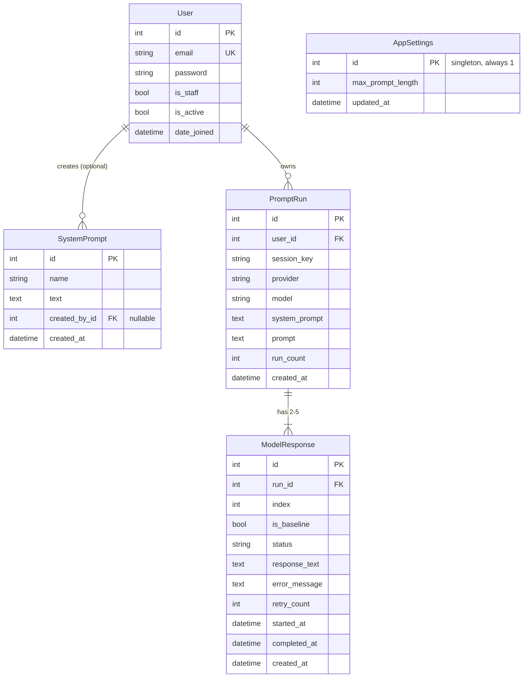

# Database Schema (Django ORM)

PostgreSQL, accessed through Django's ORM. Four models. Provider/model catalog is **not** a table
— it's static, env-driven config (`settings.LLM_PROVIDERS`), since it's set once by an admin and
never changes at runtime.

## ER overview



## Ephemeral-data note

Per the spec, prompt runs and responses must not survive logout/refresh, and there's no history
page. `PromptRun` stores `session_key` for this reason: the logout view deletes every `PromptRun`
(and, via `on_delete=CASCADE`, its `ModelResponse` rows) where `session_key` matches the session
being destroyed. A refresh keeps the same `session_key`, so an in-flight run started before the
refresh is still pollable — only logout (or session expiry) clears it. A Django-Q2 scheduled task
also purges any `PromptRun` older than a short TTL (e.g. 24h) as a safety net for sessions that
expire without an explicit logout.

## Models

```python
# accounts/models.py
from django.contrib.auth.models import AbstractUser
from django.db import models


class User(AbstractUser):
    """Email/password auth; email is the login identifier."""
    username = None
    email = models.EmailField(unique=True)

    USERNAME_FIELD = "email"
    REQUIRED_FIELDS = []
```

```python
# prompts/models.py
from django.conf import settings
from django.db import models


class SystemPrompt(models.Model):
    """Saved/reusable system prompt shown in the setup screen's library."""
    name = models.CharField(max_length=120)
    text = models.TextField()
    created_by = models.ForeignKey(
        settings.AUTH_USER_MODEL,
        on_delete=models.SET_NULL,
        null=True,
        blank=True,
        related_name="system_prompts",
    )
    created_at = models.DateTimeField(auto_now_add=True)

    class Meta:
        ordering = ["name"]

    def __str__(self):
        return self.name


class AppSettings(models.Model):
    """Singleton row holding shared, admin-editable app configuration."""
    max_prompt_length = models.PositiveIntegerField(default=600)
    updated_at = models.DateTimeField(auto_now=True)

    def save(self, *args, **kwargs):
        self.pk = 1
        super().save(*args, **kwargs)

    @classmethod
    def load(cls):
        obj, _ = cls.objects.get_or_create(pk=1)
        return obj
```

```python
# runs/models.py
from django.conf import settings
from django.db import models


class PromptRun(models.Model):
    """One 'send this prompt N times' request."""
    user = models.ForeignKey(
        settings.AUTH_USER_MODEL, on_delete=models.CASCADE, related_name="runs"
    )
    session_key = models.CharField(max_length=40, db_index=True)

    provider = models.CharField(max_length=32)
    model = models.CharField(max_length=64)
    system_prompt = models.TextField(blank=True)
    prompt = models.TextField()
    run_count = models.PositiveSmallIntegerField()

    created_at = models.DateTimeField(auto_now_add=True)

    class Meta:
        ordering = ["-created_at"]
        constraints = [
            models.CheckConstraint(
                check=models.Q(run_count__gte=2) & models.Q(run_count__lte=5),
                name="run_count_between_2_and_5",
            )
        ]

    @property
    def status(self) -> str:
        statuses = set(self.responses.values_list("status", flat=True))
        if statuses <= {"complete", "failed"}:
            return "complete"
        if "running" in statuses or "retrying" in statuses:
            return "running"
        return "queued"


class ModelResponse(models.Model):
    """One of the run_count individual LLM calls belonging to a PromptRun."""

    class Status(models.TextChoices):
        QUEUED = "queued", "Queued"
        RUNNING = "running", "Running"
        RETRYING = "retrying", "Retrying"
        COMPLETE = "complete", "Complete"
        FAILED = "failed", "Failed"

    run = models.ForeignKey(PromptRun, on_delete=models.CASCADE, related_name="responses")
    index = models.PositiveSmallIntegerField()
    is_baseline = models.BooleanField(default=False)

    status = models.CharField(max_length=10, choices=Status.choices, default=Status.QUEUED)
    response_text = models.TextField(blank=True, null=True)
    error_message = models.TextField(blank=True, null=True)
    retry_count = models.PositiveSmallIntegerField(default=0)

    started_at = models.DateTimeField(null=True, blank=True)
    completed_at = models.DateTimeField(null=True, blank=True)
    created_at = models.DateTimeField(auto_now_add=True)

    class Meta:
        ordering = ["index"]
        unique_together = ("run", "index")

    def save(self, *args, **kwargs):
        if self._state.adding and self.index == 1:
            self.is_baseline = True
        super().save(*args, **kwargs)
```

## Notes

- `ModelResponse.diff_tokens` from the API responses is **not** persisted — it's computed on read
  in the `GET /api/runs/{id}/` view by diffing each `response_text` against the run's `index=1`
  response (word-level diff, e.g. via Python's `difflib`). Keeping it out of the DB avoids storing
  a derived value that depends on which response is currently the baseline.
- `retry_count` combined with a small max-retries setting (e.g. `settings.MAX_RETRIES = 2`) backs
  the "retry failed LLM calls when possible" non-functional requirement; Django-Q2's own task
  retry/`max_attempts` handles transient failures automatically, while the `Retry` button in the UI
  covers the case where all automatic attempts were exhausted.
- No table stores LLM API keys — they're read from environment variables directly by the worker
  process, per the "never exposed to the frontend or logged" requirement.
