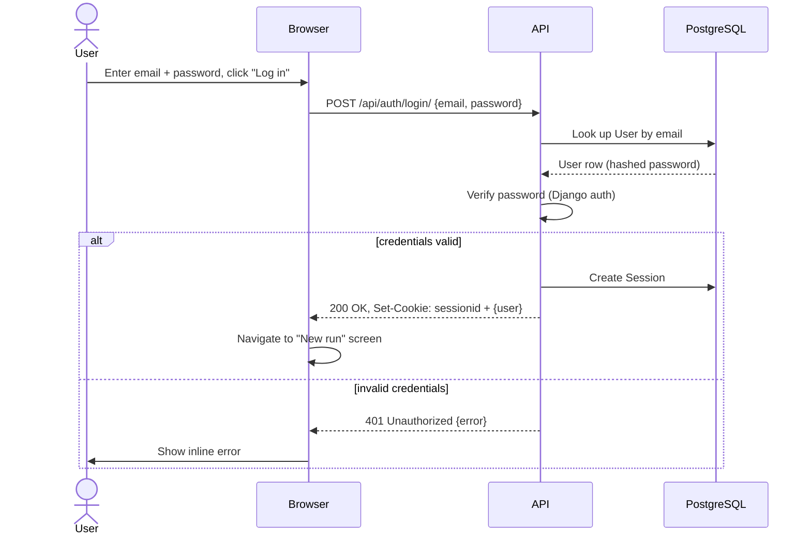
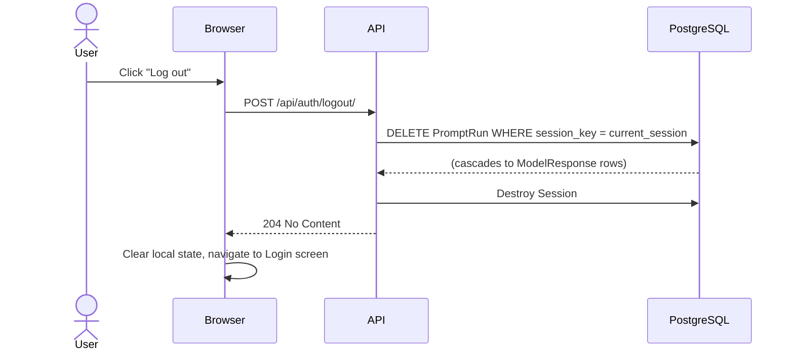
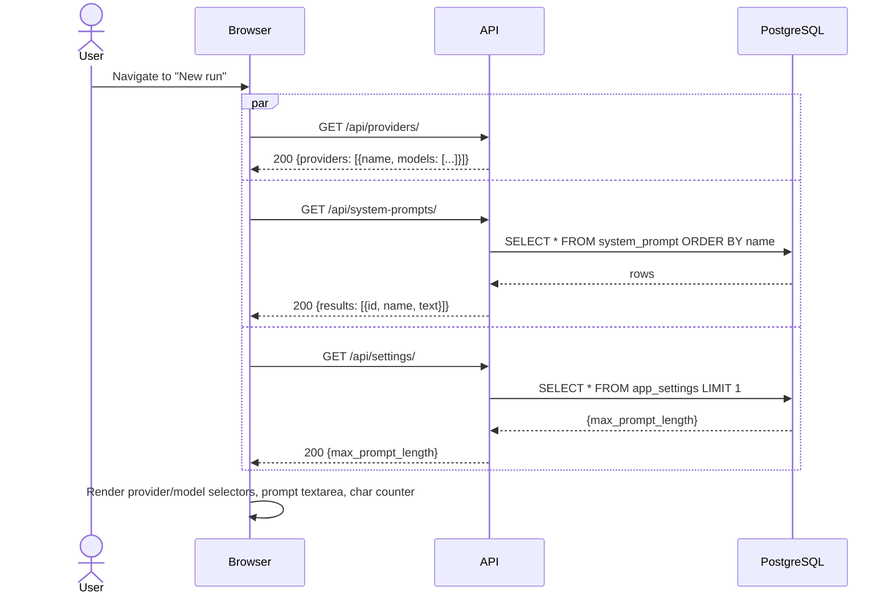
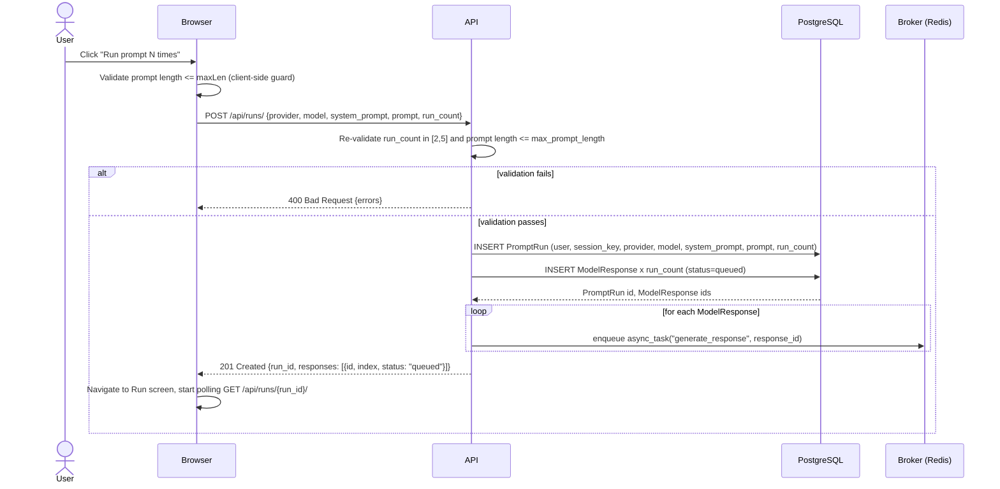
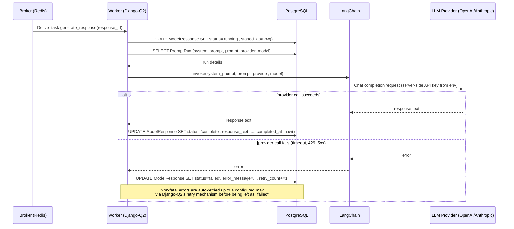
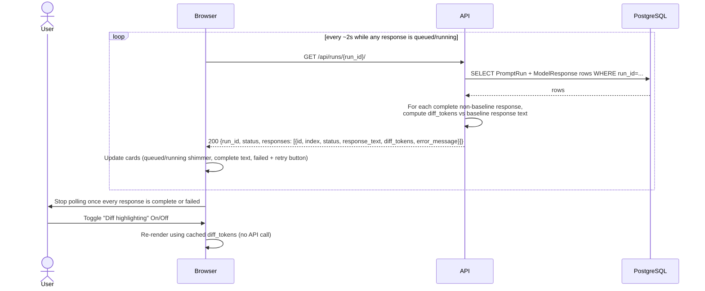
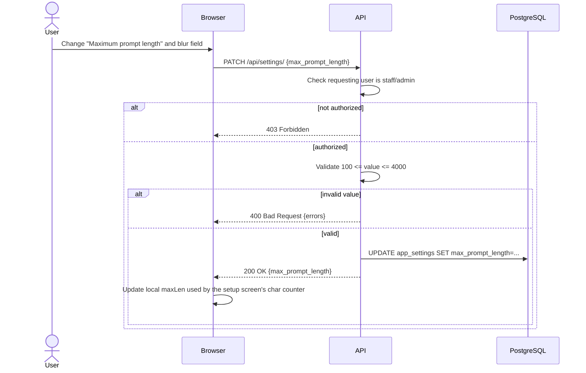

# Sequence Diagrams

Each diagram covers one user-triggered action visible in the UI mockups (`docs/UI/`). Lifelines:

- **Browser** — the React SPA
- **API** — Django (DRF) views
- **DB** — PostgreSQL
- **Broker** — Redis
- **Worker** — Django-Q2 background worker process
- **LangChain** — orchestration layer inside the worker, calling the OpenAI/Anthropic SDKs

---

## 1. Log in

Corresponds to the login screen. Django's session auth is used (cookie-based), matching
"Authentication is required for all prompt/response functionality."



---

## 2. Log out

Also enforces the ephemeral-data requirement: any prompt runs created in this session are purged
so nothing survives logout (see `db-schema.md` for the cascade).



---

## 3. Load "New run" setup screen

Fires when the user opens the setup screen (after login, or via "New run" nav link). Populates
provider/model options, the system-prompt library, and the configured max prompt length.



---

## 4. Start a prompt run (fan-out)

The core flow: user submits a prompt N times (2–5). The API creates the run + N response rows
synchronously, then enqueues one Django-Q2 task per response, and returns immediately so the
frontend can start polling.



---

## 5. Background worker generates one response

One Django-Q2 worker process per queued task. Runs independently per response, so one slow/failed
call doesn't block the others.



---

## 6. Poll run status (with diff)

The Run screen polls periodically (e.g. every 1.5–2s) until all responses reach a terminal state
(`complete` or `failed`). The API computes diff tokens for each non-baseline response against
`Run 1` (the baseline) once both are complete, so the frontend only has to toggle visibility.



---

## 7. Retry a failed response

```mermaid
sequenceDiagram
    actor U as User
    participant B as Browser
    participant A as API
    participant DB as PostgreSQL
    participant Q as Broker (Redis)

    U->>B: Click "Retry" on a failed response card
    B->>A: POST /api/responses/{response_id}/retry/
    A->>DB: SELECT ModelResponse WHERE id=response_id AND status='failed'
    alt response not found or not owned by user
        A-->>B: 404 Not Found
    else eligible for retry
        A->>DB: UPDATE ModelResponse SET status='queued', error_message=NULL
        A->>Q: enqueue async_task("generate_response", response_id)
        A-->>B: 202 Accepted {id, status: "queued"}
        B->>B: Card switches to "Retrying" state; resume polling
    end
```

---

## 8. Update app settings (max prompt length)

Settings screen, "Prompt limits" section.


