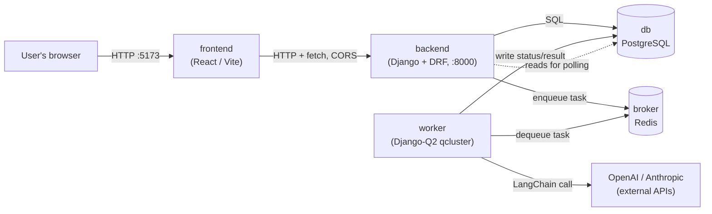

# System Architecture

Local-only deployment via Docker Compose (per the spec's Portability requirement — no cloud/production
hosting target). Six containers, one Compose network.

## Topology

- **frontend → backend**: plain HTTP/JSON over CORS; session cookie (`sessionid`) carries auth. No
  websockets — the Run screen polls `GET /api/runs/{id}/` (see
  [`docs/frontend/states.md`](../frontend/states.md)).
- **backend → db**: synchronous, request/response path (auth, CRUD, enqueue).
- **backend → broker → worker**: `POST /api/runs/` writes `PromptRun` + `ModelResponse` rows
  (`status=queued`) then enqueues one Django-Q2 task per response onto Redis.
- **worker → db**: the worker is the only writer of `ModelResponse.status`/`response_text` once a
  task starts running; it never talks to the frontend directly.
- **worker → LLM providers**: the only component with outbound internet access to OpenAI/Anthropic.
  API keys never leave this process (see [`environment.md`](./environment.md)).

Full request/response flows for each user action are diagrammed in
[`docs/backend/sequence-diagrams.md`](../backend/sequence-diagrams.md); this document only covers the
container-level topology.

## Why this shape

- **backend and worker are separate containers/processes** sharing the same Django codebase (same
  image, different entrypoint command) so that a slow/blocked LLM call never blocks API request
  handling — this is what makes "responses generated asynchronously" and "queued as background jobs"
  (spec functional requirements) possible.
- **Redis as broker only** — no Celery result backend, no cache usage assumed. Django-Q2 uses
  Postgres or Redis for task state; here Redis is the broker and Postgres is the source of truth for
  `ModelResponse` status, so polling reads always hit Postgres, not Redis.
- **LangChain isolated to the worker** — the backend process never imports the LLM SDKs; this keeps
  the request/response path free of slow, flaky external calls and matches "Security & Privacy: LLM
  provider API keys are stored server-side only" without also putting them on the API's request path.

## Mapping to non-functional requirements

| NFR (from `docs/specs/specs.md`) | How the architecture addresses it |
|---|---|
| Support ≥10 concurrent users without noticeable degradation | Django-Q2 worker can run multiple sub-processes (`Q_CLUSTER.workers`); API and worker scale independently since they're separate containers. |
| Retry failed LLM calls; recover by restarting worker/broker | Retry is a worker-owned state transition (`ModelResponse.retry_count`, `POST /api/responses/{id}/retry/`); restarting the `worker` or `broker` container resumes processing without touching `db`. |
| Auth required for all prompt/response functionality | Enforced at the Django/DRF layer (session auth); `frontend` has no direct DB or broker access. |
| API keys stored server-side only, never exposed/logged | Keys live only in the `worker` container's environment (see [`environment.md`](./environment.md)); `backend` and `frontend` never receive them. |
| Each user accesses only their own active session's runs | `PromptRun.session_key` scoping, enforced in the `backend` container's view layer (see `db-schema.md`). |
| Maintainability & Testability: modular, unit-tested core logic | Backend split into Django apps (`accounts`, `prompts`, `runs`, `llm`) per [`project-structure.md`](./project-structure.md), each independently testable without the other containers running. |
| `docker compose up` with minimal manual config | Single `docker-compose.yml` at repo root, all tunables via one `.env` file (see [`environment.md`](./environment.md)). |

## Container startup order

`db` and `broker` must be healthy before `backend` and `worker` start (migrations need `db`; task
dequeue needs `broker`). Compose `depends_on` with `condition: service_healthy` (backed by
`pg_isready` / `redis-cli ping` healthchecks) expresses this — no custom wait script is required
inside the containers themselves. See [`setup.md`](./setup.md) for the exact health-check config.
